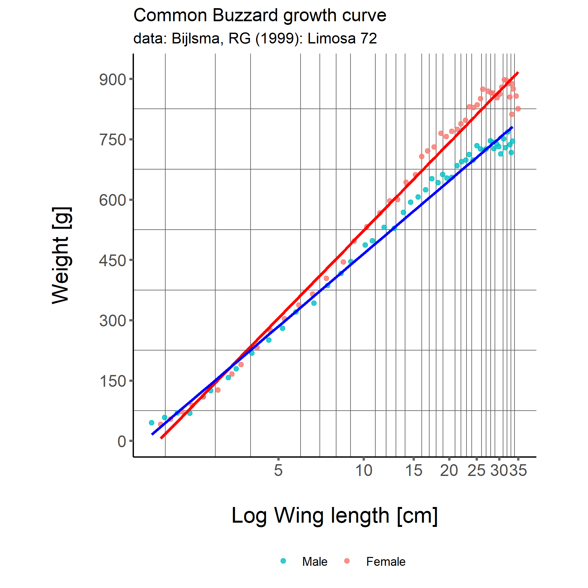
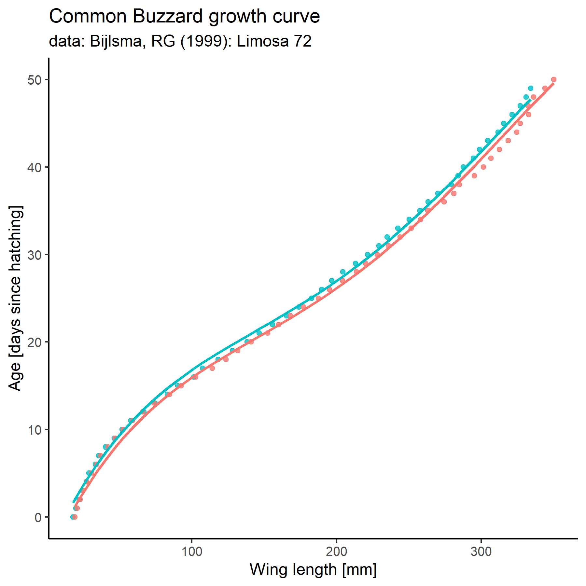

## ButeoAgeR package

------------------------------------------------------------------------

This package contains a subset of functions that are part of the
`RaptorR` package and contains functions to estimate nestling age and
body condition based on wing length and body mass measures.

## Install and load the pakcage

------------------------------------------------------------------------

To install the package, use …

``` r
devtools::install_github("mottensmann/ButeoAgeR")
```

Then, load the package …

``` r
library(ButeoAgeR)
```

Functions …

``` r
## only plot the reference data
buteo_condition(.plot = T)
```



``` r
buteo_age(.plot = T)
#> 
#> Call:
#> stats::lm(formula = data$age ~ poly(data$mean, 4, raw = T) + 
#>     data$sex)
#> 
#> Coefficients:
#>                  (Intercept)  poly(data$mean, 4, raw = T)1  
#>                   -5.078e+00                     3.647e-01  
#> poly(data$mean, 4, raw = T)2  poly(data$mean, 4, raw = T)3  
#>                   -2.211e-03                     7.472e-06  
#> poly(data$mean, 4, raw = T)4                  data$sexmale  
#>                   -8.162e-09                     8.517e-01
```



Usage …

``` r
`?`(buteo_age)
`?`(buteo_condition)
```

------------------------------------------------------------------------
